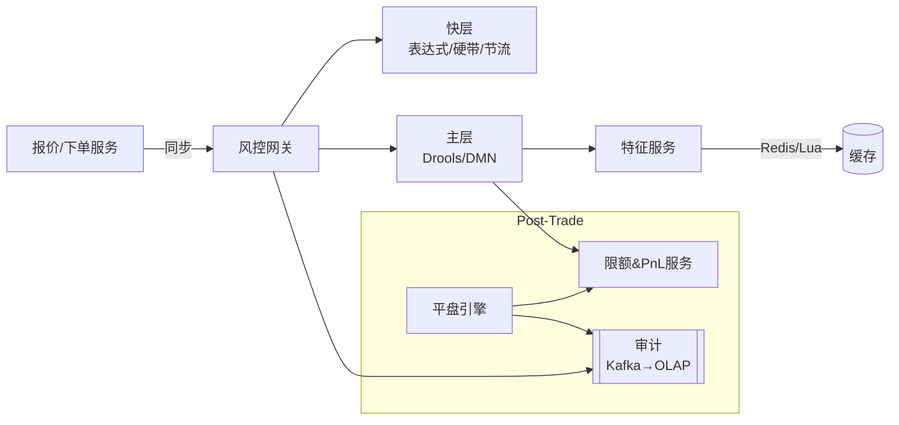

# FX 风控策略最小可运行模板（YAML + Drools + Java骨架）设计文档

> 适用场景：外汇做市与平盘（报价/下单/成交后回写）。预置 10 条风控规则：委托节流阀、撤单次数控制、价格规则、价格比例规则、订单数量限额、白名单、外汇套利损益预警限额、净敞口控制、被动风控损益控制、损益预警及锁定。

## 1. 目标与非目标
- **目标**：在 1–2 天内拉起“可运行”的 FX 风控服务：快层毫秒级拦截、主层可配置规则、Redis 特征缓存、审计可追溯。
- **非目标**：不覆盖真实行情接入、真实 PnL/敞口计算与风控审批流（这些以接口位留空）。

## 2. 总体架构
- **快层（Fast Layer）**：表达式/硬带/节流，处理 1/2/6（节流、撤单率、白名单）+ 价格带硬约束，亚毫秒级。
- **主层（Drools）**：复杂规则 3/4/5/7/8/9/10（价格、比例、订单限额、套利PnL、净敞口、被动对冲PnL、日内PnL锁定）。
- **特征缓存（Feature Cache）**：Redis + Lua 滑窗；Caffeine 本地缓存（可选）；MySQL/OLAP 低频配置与回放数据。
- **审计（Audit）**：记录决策ID、命中规则、特征快照、版本与延迟；支持回放与 OLAP 分析。



## 3. 工程结构（Maven 多模块）
```
fx-risk-template/
  pom.xml
  risk-common/           # 通用 DTO、模型
  feature-service/       # 特征服务 + Redis + Lua
  risk-engine/           # FastLayer + Drools + YAML 策略
  risk-gateway/          # SpringBoot API（/api/risk,/api/event）
  rule-center/           # 示例策略发布元数据
  scripts/               # SQL DDL、run-local.sh
```

## 4. 接口设计

### 4.1 请求/响应
```java
public record FxRiskReq(
  String type,       // QUOTE / ORDER / TRADE / CANCEL
  String desk, String trader, String book,
  String symbol, String tenor, String side,
  BigDecimal qty, BigDecimal ourBid, BigDecimal ourAsk,
  Map<String,Object> attrs
){}
public enum Decision { ALLOW, REVIEW, DENY, LOCK }
public record RiskResponse(Decision decision, String decisionId, List<String> reasons, Map<String,Object> debug) {}
```

### 4.2 HTTP Endpoint
- `POST /api/risk/check`：事前校验（报价/下单）
- `POST /api/event/trade`：成交回执（更新敞口、PnL）
- `POST /api/event/cancel`：撤单事件（更新撤单率）

## 5. 策略与参数（YAML）
关键片段（完整见 `risk-engine/.../policies/fx-policy.yaml`）：
```yaml
policy:
  version: v1.0.0
  symbols:
    EURUSD: { maxDevPips: 10, minSpreadPips: 1, maxSpreadPips: 25, ratioTol: 0.0 }
    EURJPY: { maxDevPips: 12, minSpreadPips: 1, maxSpreadPips: 30, ratioTol: 0.0015 }
limits:
  exposureUSD:
    bookA:
      EURUSD: { SPOT: 10000000, 1W: 8000000, 1M: 8000000 }
      EURJPY: { SPOT: 8000000,  1W: 6000000, 1M: 6000000 }
pnl:
  deskDefault: { warnUSD: -50000, lockUSD: -100000 }
  arb:         { warnUSD: -20000, lockUSD:  -50000 }
throttle:
  qps: { perTraderPer5s: 5 }
  cancel: { windowSec: 10, maxRate: 0.7 }
whitelist:
  - scope: TRADER
    subject: trader_vip_001
    relax: { skipRules: [R_THROTTLE, R_CANCEL_RATE], priceDevPipsBoost: 5 }
```

## 6. 10 条规则落地（摘要）
1) **委托节流阀**：滑窗计数，5s / Trader 超阈值 → DENY。  
2) **撤单次数控制**：近T秒撤单率>阈值 → REVIEW/限速。  
3) **价格规则**：ourBid/ourAsk 偏离 mid 超 pips → DENY；点差超界 → REVIEW。  
4) **价格比例规则**：EURJPY ≈ EURUSD * USDJPY 偏离 > ratioTol → REVIEW/DENY。  
5) **订单数量限额**：per-order notional 超限 → REVIEW/拆单。  
6) **白名单**：跳过节流或放宽阈值。  
7) **外汇套利损益预警**：rolling Arb PnL < warn/lock → REVIEW/限制开仓。  
8) **净敞口控制**：NE 超限 → DENY/触发被动对冲。  
9) **被动风控损益控制**：对冲滑点/累计PnL 超阈 → 暂停/切换路线。  
10) **损益预警及锁定**：日内 PnL < lock → LOCK + DENY（只许平）。

## 7. 快层与主层分工
- **快层**：白名单、节流、撤单率、价格硬带与点差范围 → 毫秒级。
- **主层（Drools）**：跨盘比例、订单限额、净敞口、套利PnL、被动对冲PnL、日内锁定。

## 8. 特征缓存与 Redis Lua
- Key 规范：`mid:*`、`win:*`、`cancel:*`、`order:*`、`expo:*`、`pnl:*`、`hedge:*`。
- 滑窗计数 `win_incr.lua`：秒级桶 + TTL 聚合，保证原子性与性能。

## 9. 审计模型（DDL）
- MySQL 明细表：`rc_audit` 保存决策、命中、特征快照与延迟。
- ClickHouse 明细表：`rc_audit_ck` 用于 OLAP 与看板。

## 10. 本地运行
```bash
# 0) 启动 Redis（本机）
redis-server --daemonize yes
# 1) 构建并启动
mvn -q -DskipTests package
java -jar risk-gateway/target/risk-gateway-0.1.0.jar
# 2) 测试
curl -s http://localhost:8088/api/risk/check -H 'Content-Type: application/json' -d '{ "type":"QUOTE","desk":"FX1","trader":"alice","book":"bookA","symbol":"EURUSD","tenor":"SPOT","side":"BUY","qty":1000000,"ourBid":1.0960,"ourAsk":1.0972,"attrs":{} }'
```

## 11. 未来扩展
- 工作内存采集器：汇总 Drools 命中为结构化 RiskResponse。
- 影子流：新旧策略并行评分（仅记录不生效）。
- GitHub Actions：CI 构建与基本单测。
- 实盘接入：真实行情、Position/PnL 服务、限额中心与审批流。
